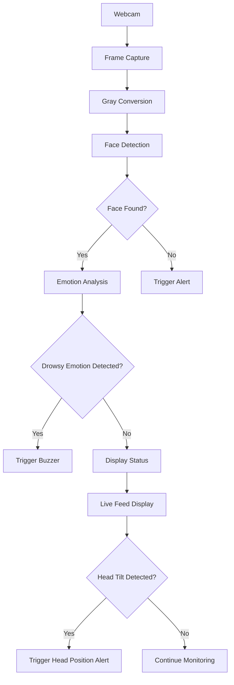

## Emotion Recognition and Driver Safety Mechanism Using Python 🚗

  
  
  
  

## Table of Contents
- [Features](#features)
- [Prerequisites](#prerequisites)
- [Installation](#installation)
- [Usage](#usage)
- [Technical Architecture](#technical-architecture)
- [Troubleshooting](#troubleshooting)
- [Development Setup](#development-setup)
- [Testing](#testing)
- [Contributing](#contributing)
- [License](#license)
- [Acknowledgments](#acknowledgments)
- [FAQ](#faq)

## Features
- 🎥 Real-time face detection using Haar Cascades
- 😴 Drowsiness detection based on facial emotions
- 🔔 Instant alert system with buzzer sound
- 🖥️ Live monitoring through webcam
- 🚦 Head position alert for safety
- 📊 Detection of drowsy emotions (tiredness, sadness, anger, fear)

## Prerequisites

| Requirement          | Description                     |
|----------------------|---------------------------------|
| 🐍 Python 3.11       | Version 3.11.9 required        |
| 📸 Webcam            | Built-in or external           |
| 💾 Storage           | 500MB+ free disk space         |
| 💻 RAM               | 4GB+ recommended               |

## Installation

```bash
git clone https://github.com/Siddharthrk17/driver-safety-monitoring.git
cd driver-safety-monitoring
pip install -r requirements.txt
```

## Usage

Run the monitoring system:

```bash
python driver_monitor.py
```

Press `q` to exit the program.

## Technical Architecture



## Troubleshooting

### 🎥 Webcam Not Detected

```bash
# Check connected devices
ls /dev/video*
```

### 🐢 Performance Issues

```bash
python driver_monitor.py --fps 30
```

### 🔊 Buzzer Not Working
Ensure system supports `winsound` (Windows only). For other OS, use alternative sound alerts.

## Development Setup

1. Clone the repository
2. Create a virtual environment
3. Install dependencies
4. Modify code with sample video inputs

## Testing

- Verify real-time monitoring with webcam
- Test emotional expressions for accuracy
- Simulate drowsy conditions for alert triggers

## Contributing

### 🔄 Contribution Workflow

1. 📈 Create an issue describing your proposal
2. 🍔 Fork the repository
3. 🌱 Create a feature branch:
   ```bash
   git checkout -b feat/new-feature
   ```
4. 🧐 Commit changes with meaningful messages
5. ✅ Push to branch and create a PR

## License

BSD 3-Clause License  - See `LICENSE` for details

## Acknowledgments

- OpenCV for face detection
- DeepFace for emotion analysis
- Python community for supporting libraries

## FAQ

### 🎮 Q1: Can I use this with recorded videos?

**A:** Yes! Modify the code:

```python
# Replace
cap = cv2.VideoCapture(0)
# With
cap = cv2.VideoCapture("input.mp4")
```

### 🎯 Q2: How to improve accuracy?

**A:** In order to increase the accuracy, ensure to follow these steps:

- 📸 Ensure proper face positioning
- 💡 Maintain even lighting
- 👓 Remove facial accessories
- ⚠️ Use higher resolution input

### 📱 Q3: Does this work on mobile devices?

**A:** Currently optimized for desktops. Mobile support requires additional adjustments.

